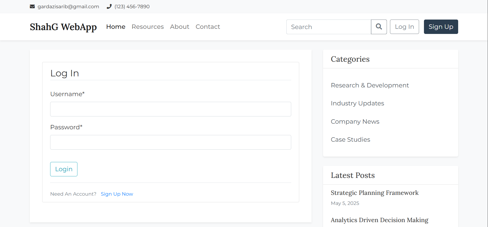
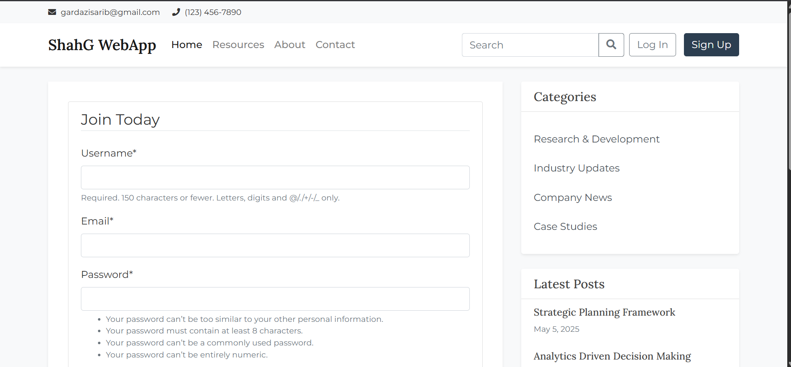
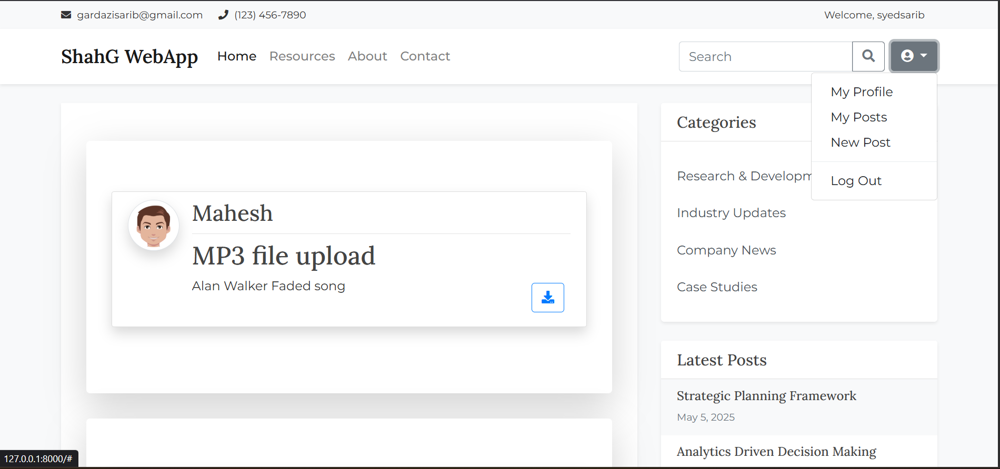

# Django Web Application

[](LICENSE)

This is a feature-rich web application built using Django, Python's popular web framework. It provides functionalities such as user authentication, file management, profile customization, and social file sharing.

---

## Features

### Core Functionalities
- **User Authentication**: Secure login system for users.
- **File Upload and Management**: Users can upload, view, and manage their files.
- **Profile Customization**: Users can set and update their profile pictures.

### Social Interaction
- **Search Users**: Ability to search for other users' profiles.
- **File Sharing**: Share uploaded files with other users.
- **Shared Files Access**: View files shared by other users alongside personal uploads.

### Additional Features
- **Multi-File Type Support**: Supports uploading various file types, including images, videos, text documents, and code files.
- **File Download**: Users can download files uploaded by others.

---

## Technologies Used

### Backend
- **Python**: Core programming language.
- **Django**: Framework for web development.

### Frontend
- **Bootstrap**: For responsive and user-friendly UI.
- **JavaScript**: For enhancing interactivity.

---

## Installation and Setup

### Prerequisites
Make sure you have Python and pip installed on your system.

### Required Python Modules
Install the following dependencies:
- Django
- django-crispy-forms
- Pillow

Run the following command to install all required modules:
```bash
pip install -r requirements.txt
```

### Running the Application
1. Navigate to the project directory.
2. Execute the following commands:
   ```bash
   python manage.py makemigrations
   python manage.py migrate
   python manage.py runserver
   ```
3. Open your browser and visit [http://127.0.0.1:8000](http://127.0.0.1:8000) or [http://localhost:8000](http://localhost:8000).

---

## Screenshots

Here are some screenshots showcasing key features of the application:

### Login Page


### Sign Up


### Main Page



---

## Credits
This project is built upon the foundational work of [smahesh29](https://github.com/smahesh29/Django-WebApp). I have extended and customized it to include additional features and improvements.
---

## License
This project is licensed under the MIT License. See the [LICENSE](LICENSE) file for more details.

---

## Note
The `SECRET_KEY` required for running and debugging the project has not been removed. You can freely use this project as a base for your own development or as a mini-project for academic purposes.
